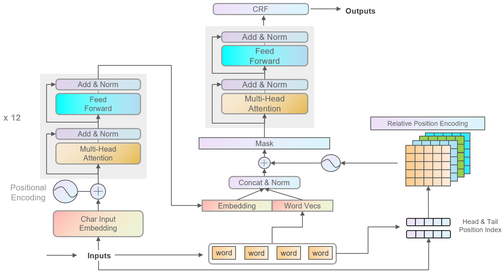

## 概览



模型结构上对结果影响较大的地方有：

1. BERT 提取的特征和word embedding 组合时，需要对应 Head & Tail position，同时加一层 layer norm，收敛速度会加快。
2. 由于是一层FLAT结构，FLAT的输出和输入的关联比较直接，需要将输入中pad的位置，mask为 0，效果会有一点提升。


另外可以试试Relative Position Encoding的不同融合方式。

```
PrivacyNER_with_NoisyData_CCF
|
├─ config.py
├─ preprocess.py
├─ main.py
├─ set_env.sh
├─ requirements.txt
├─ data
│  ├─ addition
│  ├─ dataset.py
│  └─ origin
├─ model
│  ├─ advTrain.py
│  ├─ layers
│  │  ├─ attention.py
│  │  ├─ encoder.py
│  │  ├─ flat.py
│  │  ├─ position.py
│  │  └─ structuredOut.py
│  ├─ model.py
│  ├─ mymodel.py
│  └─ trainer.py
├─ notebook
│  ├─ data_aug_nlpcda.ipynb
│  ├─ eda.ipynb
│  ├─ paddleNLP工具.ipynb
│  ├─ regex.ipynb
│  └─ traditional_model.ipynb
└─ utils
   ├─ callbacks
   │  └─ earlystop.py
   ├─ postprocess
   │  ├─ process.py
   │  └─ selfsupervise.py
   ├─ preprocess
   │  ├─ format.py
   │  ├─ process.py
   │  └─ tokenizer.py
   └─ tools.py
```


## 模型

### FLAT

FLAT部分Blog原文：https://mp.weixin.qq.com/s/6aU6ZDYPWPHc3KssuzArKw

论文：FLAT: Chinese NER Using Flat-Lattice Transformer

将Lattice图结构无损转换为扁平的Flat结构的方法，并将LSTM替换为了更先进的Transformer Encoder，更好地建模了序列的**长期依赖关系**；

提出了一种针对Flat结构的**相对位置编码机制**，使得字符与词汇信息交互更直接，在基于词典的中文NER模型中取得了SOTA。


由于中文词汇的稀疏性和模糊性，基于字符的序列标注模型往往比基于词汇的序列标注模型表现更好，但在基于字符的模型中引入**分词信息**往往能够带来性能的提升，尤其是对于NER任务来说，词汇能够提供丰富的实体边界信息。

Lattice LSTM首次提出使用Lattice结构在NER任务中融入词汇信息，如图所示，一个句子的Lattice结构是一个有向无环图，每个节点是一个字或者一个词。


#### 设计适应Lattice结构的模型


Lattice LSTM (ACL 2018): 将词汇信息引入中文NER的开篇之作，作者将词节点编码为向量，并在字节点以注意力的方式融合词向量。

Lexicon Rethink CNN(IJCAI 2019): 作者提出了含有rethink机制的CNN网络解决Lattice LSTM的词汇冲突问题。


RNN和CNN难以建模长距离的依赖关系，且在Lattice LSTM中的字符只能获取前向信息，没有和词汇进行足够充分的全局交互


#### FLAT

[Git Repo](https://github.com/LeeSureman/Flat-Lattice-Transformer)

从Transformer的position representation得到启发，作者给每一个token/span(字、词)增加了两个位置编码，分别表示该span在sentence中开始(head)和结束(tail)的位置


扁平的结构允许我们使用Transformer Encoder，其中的self-attention机制允许任何字符和词汇进行直接的交互


#### Relative Position Encoding of Spans

span是字符和词汇的总称，span之间存在三种关系：交叉、包含、分离，然而作者没有直接编码这些位置关系，而是将其表示为一个稠密向量。作者用 和 表示span的头尾位置坐标，并从四个不同的角度来计算 和 的距离：


使用$A^{*}_{i,j}$代替 tranformer 的self attention 中的 $A_{i,j}$:


通过FLAT模型后，取出token的编码表示，将其送入CRF层进行解码得到预测的标签序列。

论文中给出的结果显示，FLAT相较于一众NER模型，取得了SOTA的效果。同时，使用较大规模数据时，效果更好。在对比实验中发现，字符与包含它的词汇之间的充分交互是很重要的。

```python
class MultiHeadAttention(nn.Module):
    def __init__(self, hidden_size, num_heads, scaled=True, attn_dropout=None):
        super(MultiHeadAttentionRel, self).__init__()

        self.hidden_size = hidden_size

        self.num_heads = num_heads
        self.per_head_size = self.hidden_size // self.num_heads
        self.scaled = scaled
        assert (self.per_head_size * self.num_heads == self.hidden_size)

        # 正常 attention 的 q,k,v 变换矩阵
        self.w_k = nn.Linear(self.hidden_size, self.hidden_size)
        self.w_q = nn.Linear(self.hidden_size, self.hidden_size)
        self.w_v = nn.Linear(self.hidden_size, self.hidden_size)

        # 计算 Rij 的权重
        self.w_r = nn.Linear(self.hidden_size, self.hidden_size)

        # 计算 A* 的权重
        self.u = nn.Parameter(torch.randn(self.num_heads, self.per_head_size), requires_grad=True)
        self.v = nn.Parameter(torch.randn(self.num_heads, self.per_head_size), requires_grad=True)

        self.dropout = nn.Dropout(attn_dropout)

    def forward(self, key, query, value, pos, flat_mask):
        "pos 为 自定义的 postion embedding，对应公式的 Rij"
        batch = key.size(0)

        # 输入线性变换
        key = self.w_k(key)
        query = self.w_q(query)
        value = self.w_v(value)
        rel_pos_embedding = self.w_r(pos)

        ####### 计算 A* 矩阵的方法 和 论文不是完全一致
        # batch, seq_len, n_head, d_head
        key = torch.reshape(key, [batch, -1, self.num_heads, self.per_head_size])
        query = torch.reshape(query, [batch, -1, self.num_heads, self.per_head_size])
        value = torch.reshape(value, [batch, -1, self.num_heads, self.per_head_size])
        # batch, seq_len, seq_len, n_head, d_head
        rel_pos_embedding = torch.reshape(rel_pos_embedding,
                                          list(rel_pos_embedding.size()[:3]) + [self.num_heads, self.per_head_size])

        # batch, n_head, seq_len, d_head
        key = key.transpose(1, 2)
        query = query.transpose(1, 2)
        value = value.transpose(1, 2)

        # batch, n_head, d_head, seq_len
        key = key.transpose(-1, -2)

        # 1, num_heads, 1, d_head
        u_for_c = self.u.unsqueeze(0).unsqueeze(-2)

        # batch, n_head, seq_len, d_head
        query_and_u_for_c = query + u_for_c

        # batch, n_head, seq_len, seq_len
        A_C = torch.matmul(query_and_u_for_c, key)

        # batch, n_head, seq_len, d_head, seq_len
        rel_pos_embedding_for_b = rel_pos_embedding.permute(0, 3, 1, 4, 2)
        # batch, n_head, seq_len, seq_len, 1, d_head
        query_for_b = query.view([batch, self.num_heads, query.size(2), 1, self.per_head_size])
        # batch, n_head, seq_len, seq_len, 1, d_head
        query_for_b_and_v_for_d = query_for_b + self.v.view(1, self.num_heads, 1, 1, self.per_head_size)

        # batch, n_head, seq_len, seq_len
        B_D = torch.matmul(query_for_b_and_v_for_d, rel_pos_embedding_for_b).squeeze(-2)

        # batch, n_head, seq_len, seq_len
        attn_score_raw = A_C + B_D

        # 计算 score
        if self.scaled:
            attn_score_raw = attn_score_raw / math.sqrt(self.per_head_size)

        mask = 1 - flat_mask.long().unsqueeze(1).unsqueeze(1)
        attn_score_raw_masked = attn_score_raw.masked_fill(mask.bool(), -1e15)

        # batch, n_head, seq_len, seq_len
        attn_score = F.softmax(attn_score_raw_masked, dim=-1)
        attn_score = self.dropout(attn_score)

        # batch, n_head, seq_len, d_head
        value_weighted_sum = torch.matmul(attn_score, value)
        # batch, seq_len, n_head, d_head -> batch, seq_len, hidden_size
        result = value_weighted_sum.transpose(1, 2).contiguous().reshape(batch, -1, self.hidden_size)

        return result
```


### BERT

教程博客很多，比如 http://jalammar.github.io/illustrated-bert/


### CRF

参考 https://racleray.github.io/2020/11/18/CRF-SimpleNote/, https://racleray.github.io/2021/02/22/%E6%B5%85%E6%B6%89%E7%9F%A5%E8%AF%86%E5%9B%BE%E8%B0%B1/


### MRC

论文：A Unified MRC Framework for Named Entity Recognition

[Git Repo](https://github.com/ShannonAI/mrc-for-flat-nested-ner?utm_source=catalyzex.com)

转换为阅读理解（MRC）任务，来解决NER问题。似乎有很多搞研究的，都在尝试将NLP问题转换到MRC框架下，解决问题。

目的，解决NER中的实体重叠、嵌套关系问题。这是序列建模方式，比较难处理的问题。

数据，处理为三元组形式：(问题，答案，上下文)

> 其中，问题：一段对 实体类型 的描述文字，多种实体，就有多个问题；答案：为 实体的起始 index；上下文就是待识别的整个文本。

模型，使用BERT：


每个token预测输出有两个，是否为实体开始字，是否为实体结束字。


输出为 2 维，是和不是的预测概率。分别对每个位置判断，是否为开始字或者结束字。


但是这个两个集合，在有监督数据条件下，即训练时，并没有必要，只在预测推断时使用（推断需要通过下式计算所有组合的概率 P）。因为下式：


直接根据标注数据的 i, j 对标注部分计算 P。而不用对所有 i, j 组合算一次 P。

损失，多个预测损失之和：


权重为超参数。


### Simple-Lexicon

论文：Simple-Lexicon：Simplify the Usage of Lexicon in Chinese NER

[Git Repo](https://github.com/v-mipeng/LexiconAugmentedNER?utm_source=catalyzex.com)

在Embedding信息的输入上进行改进，尝试了多种方式。

> 1. Softword：使用分词工具，标记词的 BMESO，结合字向量和标记向量输入。存在误差传播问题，无法引入一整个词汇对应word embedding
>
> 2. ExtendSoftword：组合所有字的所有BME，得到可能的词，但是无法复原原始的词汇信息是怎样
>
> 3. Soft-lexicon：对当前字符，依次获取BMES对应所有词汇集合。
>
>    
>
>    根据词频加权词向量，与字向量求和。

该模型比Lattice LSTM, WC-LSTM等，在输入embedding上进行改进的模型，效果更好，更容易使用和迁移。


## 策略

### Positive-unlabeled learning -- PU Learning

> 在只有正类和无标记数据的情况下，训练二分类器

> Method 1   Directly 
>
> 1. 将正样本和部分筛选出的未标记样本分别看作是positive samples和negative samples
> 2. 训练一个分类器，输出样本属于正、负类的概率
> 3. 使用训练好的分类器。分类未标注数据，若正类的概率 大于 负类的概率，则该未标注样本的更可能为正类
>
> 
>
> Method 2   PU bagging
>
> 1. 将所有正样本和未标记样本进行随机组合 bootstrap 来创建训练集；
> 2. 将正样本和未标记样本视为positive和negative，训练一个分类器；
> 3. 将分类器应用于不在训练集中的未标记样本 OOB（“out of bag”），并记录其分数；
> 4. 重复上述三个步骤，最后每个未标记样本的分数为每一轮 OOB分数 的平均值。
>
> 
>
> Method 3
>
> 人工标注一部分确认为负类的数据，训练分类器识别这些 确认为 负类的数据。
>
> 
>
> [示例](https://github.com/phuijse/bagging_pu/blob/master/PU_Learning_simple_example.ipynb) [示例](https://github.com/roywright/pu_learning/blob/master/circles.ipynb)

论文：Distantly Supervised Named Entity Recognition using Positive-Unlabeled Learning，将PU Learning应用在NER任务上 [Git Repo](https://github.com/v-mipeng/LexiconNER)：

> 1. 首先有 未标记数据 Du，实体字典 Dict；
>
> 2. 使用最大匹配方法，标记一部分 Du，是NE则为正类，不是NE则为负类；
>
>    
>
> 3. 对每一种NE类型（比如，Loc，Nane）训练一个PU 分类器（自定义的神经网络模型）；
>
> 4. 使用多个PU 分类器，对剩余的 Du，进行预测，每一个词，取预测概率最大的那一类标记；
>
> 5. 若某些 词 多次被预测为 实体，且每次出现都被预测为同一类实体，那么，将这个词，加入Dict；
>
> 6. 重复以上步骤，直到Dict不再改变。

方法是这么个方法，实际上代码并没有如此实现😅。代码里面的 loss mask 的使用方式，使用多个k flod 的子模型重新对训练数据进行预测投票，并删除得票数少于阈值的标记。目的是为了减少噪声数据。这和我查到的PU learning的思想是不一致的。

另外，这种投票的方法可以用在 test data 中，但是是提取 得票数高于阈值的 样例和预测标记。加到训练数据中，如此这般 半监督学习，是不是更nice？嗯，想法不错。


### FGM

[引用Blog原文](https://zhuanlan.zhihu.com/p/91269728)

对抗可以作为一种防御机制，并且经过简单的修改，便能用在NLP任务上，提高模型的泛化能力。对抗训练可以写成一个插件的形式，用几行代码就可以在训练中自由地调用。

在原始输入样本 ![[公式]](https://www.zhihu.com/equation?tex=x) 上加一个扰动 ![[公式]](https://www.zhihu.com/equation?tex=+r_%7Badv%7D) ，得到对抗样本后，用其进行训练。将输入样本向着损失上升的方向再进一步，得到的对抗样本就能造成更大的损失，提高模型的错误率。问题可以被抽象成这么一个模型：

![[公式]](https://www.zhihu.com/equation?tex=+%5Cmin_%7B%5Ctheta%7D-%5Clog+P%28y%7Cx%2Br_%7Badv%7D%3B%5Ctheta%29+)

其中， ![[公式]](https://www.zhihu.com/equation?tex=y) 为gold label， ![[公式]](https://www.zhihu.com/equation?tex=%5Ctheta) 为模型参数。Goodfellow认为，神经网络由于其线性的特点，很容易受到线性扰动的攻击。于是，他提出了 Fast Gradient Sign Method (FGSM) ：

![[公式]](https://www.zhihu.com/equation?tex=r_%7Badv%7D+%3D+%5Cepsilon+%5Ccdot+%5Ctext%7Bsgn%7D%28%5Ctriangledown_x+L%28%5Ctheta%2C+x%2C+y%29%29)

其中， ![[公式]](https://www.zhihu.com/equation?tex=%5Ctext%7Bsgn%7D) 为符号函数， ![[公式]](https://www.zhihu.com/equation?tex=L) 为损失函数。Goodfellow发现，令 ![[公式]](https://www.zhihu.com/equation?tex=%5Cepsilon%3D0.25) ，用这个扰动能给一个单层分类器造成99.9%的错误率。

Goodfellow还总结了对抗训练的两个作用：

1. 提高模型应对恶意对抗样本时的鲁棒性；
2. 作为一种regularization，减少overfitting，提高泛化能力。

从优化的视角，问题重新定义成了一个找鞍点的问题，Min-Max：内部损失函数的最大化，外部经验风险的最小化：

![[公式]](https://www.zhihu.com/equation?tex=%5Cmin_%5Ctheta+%5Cmathbb%7BE%7D_%7B%28x%2C+y%29%5Csim+%5Cmathcal%7BD%7D%7D+%5B%5Cmax_%7Br_%7Badv%7D+%5Cin+%5Cmathcal%7BS%7D%7D+L%28%5Ctheta%2C+x%2Br_%7Badv%7D%2C+y%29%5D)

1. 内部max是为了找到worst-case的扰动，也就是攻击，其中， ![[公式]](https://www.zhihu.com/equation?tex=L) 为损失函数， ![[公式]](https://www.zhihu.com/equation?tex=%5Cmathcal%7BS%7D) 为扰动的范围空间。
2. 外部min是为了基于该攻击方式，找到最鲁棒的模型参数，也就是防御，其中 ![[公式]](https://www.zhihu.com/equation?tex=%5Cmathcal%7BD%7D) 是输入样本的分布。

CV任务的输入是连续的RGB的值，而NLP问题中，输入是离散的单词序列，一般以one-hot vector的形式呈现，如果直接在raw text上进行扰动，那么扰动的大小和方向可能都没什么意义。Goodfellow在17年的[ICLR](https://arxiv.org/abs/1605.07725)中提出了可以在连续的embedding上做扰动。在CV任务，根据经验性的结论，对抗训练往往会使得模型在非对抗样本上的表现变差，然而神奇的是，在NLP任务中，模型的泛化能力反而变强了。

因此，**在NLP任务中，对抗训练的角色不再是为了防御基于梯度的恶意攻击，反而更多的是作为一种regularization，提高模型的泛化能力**。


对抗训练，FSGM的修改版本，取消了符号函数，对梯度计算进行scale，而不是只使用 +1 或者 -1 代替。

> 1. 原网络进行一次，前向反向传播，得到梯度g
>
> 2. 计算embedding矩阵的修正梯度 r:
>
>    $r=\frac{\epsilon g}{\|g\|_{2}}$
>
> 3. 输入 embedding + r ，计算对抗梯度 ga
>
> 4. 将 ga 累加到 g 中，得到 gf
>
> 5. 恢复原网络的embedding数值，使用 gf 对参数进行更新


**Projected Gradient Descent（PGD）**：**“小步走，多走几步”**，如果走出了扰动半径为 ![[公式]](https://www.zhihu.com/equation?tex=%5Cepsilon) 的空间，就映射回“球面”上，以保证扰动不要过大。

![[公式]](https://www.zhihu.com/equation?tex=%5Cbegin%7Balign%7D+x_%7Bt%2B1%7D+%26%3D+%5CPi_%7Bx%2B%5Cmathcal%7BS%7D%7D%28x_t%2B%5Calpha+g%28x_t%29%2F%7C%7Cg%28x_t%29%7C%7C_2%29+%5C%5C+g%28x_t%29+%26%3D+%5Ctriangledown_x+L%28%5Ctheta%2C+x_t%2C+y%29+%5Cend%7Balign%7D+)

其中 ![[公式]](https://www.zhihu.com/equation?tex=%5Cmathcal%7BS%7D%3D%7Br%5Cin%5Cmathbb%7BR%7D%5Ed%3A%7C%7Cr%7C%7C_2+%5Cleq+%5Cepsilon%7D) 为扰动的约束空间， ![[公式]](https://www.zhihu.com/equation?tex=%5Calpha) 为小步的步长。

PGD模型能够得到一个**非常低且集中的loss分布**。

另外在半监督条件下，也可以使用对抗训练方法Virtual Adversarial Training进行半监督训练。


示例代码

```python
import torch


grad_backup = {}


def save_grad(tensorName):
    def backward_hook(grad: torch.Tensor):
        grad_backup[tensorName] = grad

    return backward_hook


class PGD:
    def __init__(self, model):
        self.model = model
        self.emb_backup = {}

    def attack(self,
               epsilon=1.,
               alpha=0.3,
               emb_name='emb.',
               is_first_attack=False):
        for name, param in self.model.named_parameters():
            if param.requires_grad and emb_name in name:
                if is_first_attack:
                    self.emb_backup[name] = param.data.clone()
                norm = torch.norm(param.grad)
                if norm != 0 and not torch.isnan(norm):
                    r_at = alpha * param.grad / norm
                    param.data.add_(r_at)
                    param.data = self.project(name, param.data, epsilon)

    def restore(self, emb_name='emb.'):
        # emb_name这个参数要换成你模型中embedding的参数名
        for name, param in self.model.named_parameters():
            if param.requires_grad and emb_name in name:
                assert name in self.emb_backup
                param.data = self.emb_backup[name]
        self.emb_backup = {}

    def project(self, param_name, param_data, epsilon):
        r = param_data - self.emb_backup[param_name]
        if torch.norm(r) > epsilon:
            r = epsilon * r / torch.norm(r)
        return self.emb_backup[param_name] + r

    def backup_grad(self):
        # 此处也可以直接用一个成员变量储存 grad，而不用 register_hook 存储在全局变量中
        for name, param in self.model.named_parameters():
            if param.requires_grad:
                param.register_hook(save_grad(name))

    def restore_grad(self):
        for name, param in self.model.named_parameters():
            if param.requires_grad:
                param.grad = grad_backup[name]


if __name__ == '__main__':
    # 示例过程
    pgd = PGD(model)
    K = 3 # 小步走的步数
    for batch_input, batch_label in data:
        # 正常训练
        loss = model(batch_input, batch_label)
        loss.backward() # 反向传播，得到正常的grad
        pgd.backup_grad()

        # 对抗训练
        for t in range(K):
            pgd.attack(is_first_attack=(t==0)) # 在embedding上添加对抗扰动, first attack时备份param.data
            if t != K-1:
                model.zero_grad()
            else:
                pgd.restore_grad()
            loss_adv = model(batch_input, batch_label)
            loss_adv.backward() # 反向传播，并在正常的grad基础上，累加对抗训练的梯度
        pgd.restore() # 恢复embedding参数

        # 梯度下降，更新参数
        optimizer.step()
        model.zero_grad()
```

```python
import torch


class FGM:
    def __init__(self, model):
        self.model = model
        self.backup = {}

    def attack(self, epsilon=1, emb_name='emb.'):
        for name, param in self.model.named_parameters():
            if param.requires_grad and emb_name in name:
                self.backup[name] = param.data.clone()
                norm = torch.norm(param.grad)
                if norm != 0 and not torch.isnan(norm):
                    r_adv = epsilon * param.grad / norm
                    param.data.add_(r_adv)

    def restore(self, emb_name='emb.'):
        for name, param in self.model.named_parameters():
            if param.requires_grad and emb_name in name:
                assert name in self.backup
                param.data = self.backup[name]
        self.backup = {}


if __name__ == "__main__":
    # 示例过程
    fgm = FGM(model)
    for batch_input, batch_label in data:
        # 正常训练
        loss = model(batch_input, batch_label)
        loss.backward()  # 反向传播，得到正常的grad
        # 对抗训练
        fgm.attack()  # 在embedding上添加对抗扰动
        loss_adv = model(batch_input, batch_label)
        loss_adv.backward()  # 反向传播，并在正常的grad基础上，累加对抗训练的梯度
        fgm.restore()  # 恢复embedding参数
        # 梯度下降，更新参数
        optimizer.step()
        model.zero_grad()
```


### SWA

Stochastic Weight Averaging，方法的提出者认为，训练期间得到的局部最小值 倾向于 在损失值较低的区域的边界，而不是集中在损失更低的区域中心部分。所以，Stochastic Weight Averaging可以通过对边界的平均，得到更好性能和更好泛化性能的模型。[Git Repo](https://github.com/timgaripov/swa)

> 1. 保存两套权重w, wswa；
>
> 2. 使用循环学习率，训练w；
>
> 3. 达到指定轮次，更新ws，$n_{models}$指更新$w_{swa}$时，中间间隔的轮次:
>
>    $w_{swa} = \frac{w_{swa}n_{models}+w}{n_{models}+1}$
>
> 4. 循环以上步骤，最后使用wswa，作为最终模型

有可以直接使用的工具，比较方便。~*from* torchcontrib.optim *import* SWA~

```python
optimizer = torch.optim.Adam(params_lr)
# Stochastic Weight Averaging
optimizer = SWA(optimizer)


if ...:
    optimizer.update_swa()
    
...
# 训练结束时使用收集到的swa moving average
optimizer.swap_swa_sgd()
# optimizer.bn_update(
#     train_dataloader,
#     model)  # 更新BatchNorm的 running mean

# save
```


参考链接：

[2020CCF-NER](https://github.com/BaberMuyu/2020CCF-NER)

[Flat-Lattice-Transformer](https://github.com/LeeSureman/Flat-Lattice-Transformer)
